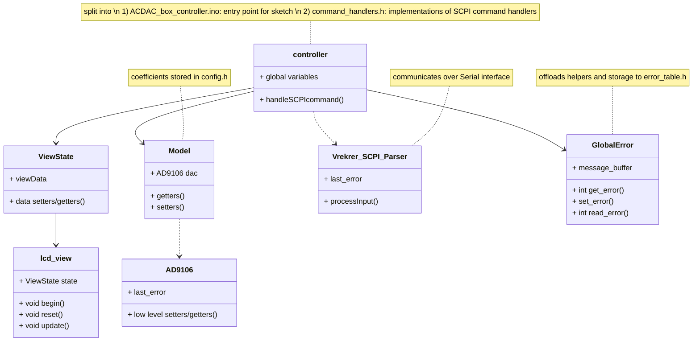
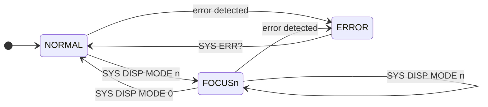
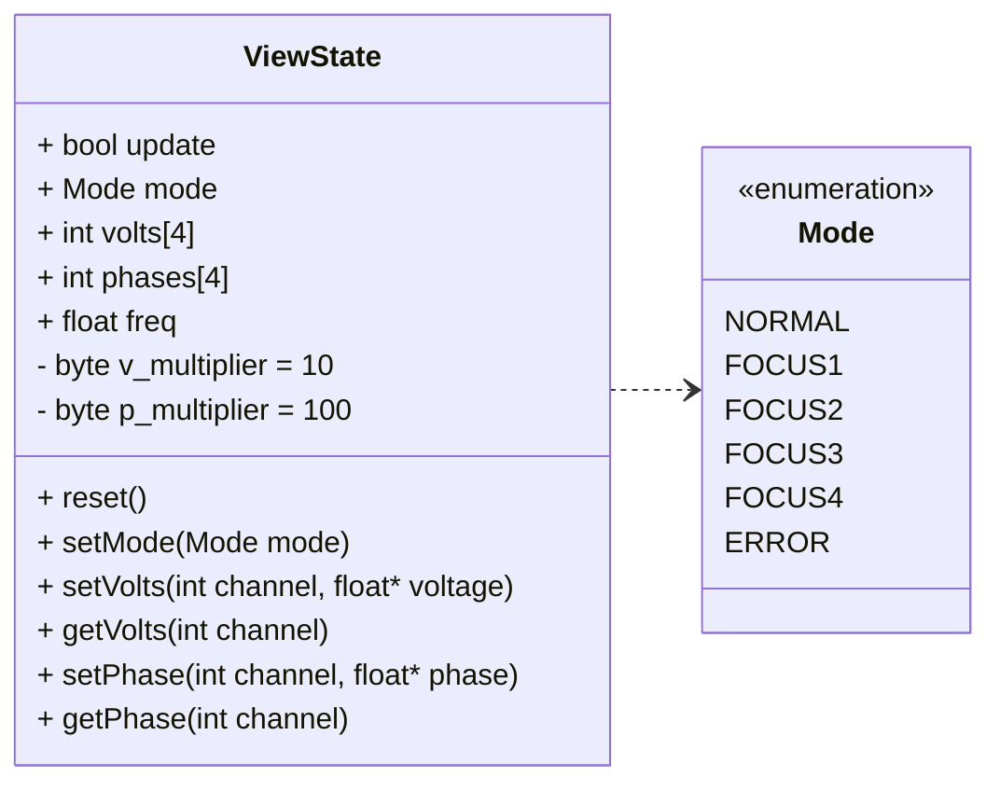

# ACDAC_box_driver
Arduino Driver code for AC DAC Waveform generator box 

TODO: add user guide/link to SOP

## Dependencies 
1. [AD9106](https://github.com/barreralab/AD9106): Handles low level interactions with the EVAL-AD9106 board
2. [Vrekrer_scpi_parser](https://github.com/Vrekrer/Vrekrer_scpi_parser): SCPI command handling
4. [Adafruit_LiquidCrystal](https://www.arduino.cc/reference/en/libraries/adafruit-liquidcrystal/): Handles low level interactions with lcd

## How to Use
Follow the SOP for hardware and wiring instructions. Download the dependency libraries according to their documentation.

## Supported Commands
**TODO** Move section to readme 
* `*IDN?` - Prints identification string
* `*RST` - Resets to default configuration (0mV rms, 0° on each channel at 50kHz)
* `FREQ/?` - Sets DDS frequency or queries current setting
* `PATtern` - Controls waveform patterns
    * `:STOP` - Stops wave generation
    * `:START` - Starts wave generation
    * `:UPDate` - Updates wave settings
* `CHANnel<n>` - Selects or configures a specific channel n = 1,2,3,4
    * `:VOLTage/?` - Sets channel n output voltage or queries current setting
    * `:PHASE/?` - Sets channel n phase offset or queries current setting
* `SYStem` - System-level commands
    * `:ERRor?` - Queries and clears the last system error
    * `:REGister/?` - Sets an AD9106 register or queries current setting
    * `:DISPlay`
        * `:MODE <n>` switches display to focus on channel n if n = 1,2,3,4 or normal display mode if n = 0

# Overview
Welcome to the ACDAC_box_driver wiki!

The pages here will discuss the design choices and some implementation details of the firmware for the AC-DAC-02 signal generator box. We loosely follow a Model-View-Controller framework in that we have a controller, model, and view (implemented as an lcd character display) but this view doesn't take user input. Input is instead sent over the Serial interface. Strict adherence to MVC would require us to include this in the view, but that's somewhat complicated by the implementation of the Vrekrer_SCPI_Parser which depends on a communication interface.


Here is a high-level UML diagram for the system. 



> [!NOTE]
> Solid arrows represent associations while dashed arrows represent dependencies. Apart from the controller card and dependencies like the AD9106 and Vrekrer_SCPI_Parser, the implementations of the other classes are defined in header files with identical names, i.e the GlobalError class is defined in GlobalError.h

# Controller 
The controller for the system is split between ACDAC_box_driver.ino and command_handlers.h. The split is mostly aesthetic. Together, they manage input data from the serial interface to control the model (abstraction of the system logic) and view (the lcd screen in this case). In particular, the controller is responsible for packaging the string data from the serial interface into appropriate formats for the model and view. ACDAC_box_driver.ino serves as the entry point to the system. It initializes the model and view components, does the necessary injections and houses the setup and loop functions. The command_handlers.h file contains the implementations for the received SCPI commands.  

# View and ViewState
## State Diagram

`SYS:DISP:MODE n` switches display mode to FOCUS<n> if n = 1,2,3,4 or NORMAL if n = 0 
FOCUS<n> mode displays more information about channel n output. More precision is also displayed. Accomplished by using ViewState




## ViewState

The ViewState encapsulates the data for the lcd view and is injected into the view on initialization. 
```c++
ViewState viewState;
View view(...pins..., &viewState);
```



> [!NOTE]
> **Why a class for viewState instead of a struct?** It started off as a struct, but then to reduce memory space I started storing the voltage and phase data as integers with a multiplier. Then, setting and getting the data required some additional code. By the end, a class seemed more suitable. Plus it's more extendible this way.

The viewState stores voltage and phase as integers by multiplying the float values by multipliers of $10^1$ and $10^2$ respectively and rounding. Using an arbitrary $10^n$ multiplier allows for $n$ digits of precision. For the voltage, we only have precision to 1 digit anyways. 

> [!WARNING]
> You can run into overflow errors using this approach. For example, if we were storing voltages as signed 16 bit integers, i.e `int volts[4]`, then we can only store values within $[-2^{15} = -32768 , 2^{15} - 1 = 32767]$. Thus, if we used a $10^2$ multiplier on our voltages, we would overflow for voltages greater than 328. Either decrease the multiplier (and lose precision) or, if applicable, use unsigned integers, `uint16_t volts[4]` which allow for values in range $[0, 2^{16} - 1 = 65535]$

## View
On each iteration of the arduino loop, we call `view.update()` and internally, the lcd screen updates iff the boolean update flag in viewState is set to true. That way we prevent flickering. 

The view interface is 

```c++
#include "ViewState.h"

class View {
    ViewState state;
    View(ViewState *state);
    
    void begin();
    void reset();
    void update();
}
```

Thus the lcd screen can be replaced with a different view implementation as long as it maintains this interface.

# Model 
The model.h file defines the Model class which provides another layer of abstraction between the EVAL board and it's high level controls.  
> [!NOTE]
> **Why the need if AD9106 Library exists?** The AD9106 library is dedicated to controlling the EVAL-AD9106 board and provides an interface that allows users to configure board settings with more ease. However, in isolation, the library has no notion of the eventual circuit that the board will be integrated in. In our case, we want to be able to specify a desired voltage and have the board output that voltage on a given channel. Since this is dependent on our circuitry, we have to specify how to translate these values into register values. The AD9106 library will deal with the minutiae of setting the register value. Beyond that, the AC Box may expand to include more components such as an external clock. In which case, the Model class would also manage this device along with the AD9106. Thus, using a model on top of the AD9106 library allows for scalability

# Error Handling
There are currently 3 sources of error. 
1. *SCPI Level Errors*: Unknown commands, buffer overflows, timeouts, etc. These are defined in VrekrerSCPIParser's `ErrorCode` enum
2. *Generic Errors*: Parameter errors, bad ranges, etc. These are controller level issues defined in the `GenericError` enum (found in the error_table.h file)
3. *AD9106 Errors*: Configuration and register errors for the AD9106 card, defined in the AD9106 `ErrorCode` enum. You can invoke a `SHORT_PATTERN_DELAY` error by writing a value less than 0xe to register 20. See the Ad9106 Github for more detail on the exact error handling system.

We implement an circular buffer that stores the latest 5 errors in the system by using an array that overwrites its element at an index which is incremented modulus the buffer size on each insert. Thus, new errors are always stored while older errors are buffered out. We can insert and get the most recent error in $\mathcal O(1)$ time each. 

The `ErrorData`structure stores an integer error code and a pointer to some space in flash memory containing the error string.

```c++
    void push(int code, const char *msg_ptr) {
      // populate last queue element with data
      queue[write_indx].code = code;
      queue[write_indx].message_ptr = msg_ptr;

      write_indx = (write_indx + 1) % MAX_QUEUE_SIZE;
      if (queue_size < MAX_QUEUE_SIZE) {
        queue_size++;
      }
    }
```

# Fixes
```c++
  float _get_amp_addr(float voltage, const float coeffs[6]) {
    float freq = dac.getDDSfreq();

    // absorb factor of 10^(-5) from fit function
    float numerator = (100 * voltage) - (10 * coeffs[4]);
    float freq_poly = 0;
    int freq_order = get_order(freq);
    for (int i = 0; i < 4; i++) {
      // get difference in magnitudes of polynomial term
      int order_diff = (exps[i] - 5) - freq_order * (i + 1);
      if (-10 <= order_diff && order_diff <= 10) {
        float freq_sigval = freq / pow(10, freq_order);
        freq_poly += coeffs[i] * pow(freq_sigval, i + 1) * pow(10, -order_diff);
      }
    }

    float addr = numerator / (freq_poly + coeffs[5]);
    return addr;
  }
```

# Arduino Tips and Tricks
## Saving Memory 

## IDE and compiler settings 
It's tiresome to use the plain Arduino IDE to develop larger scale software given how featureless it is. I preferred to edit the codebase in vscode using the C/C++ extension. You do have to configure the C/C++ include path to find the Arduino Libraries and boards you use to silence vscode include warnings. That involves finding out where your arduino installation is. For windows, adding paths of these forms works for the Arduino UNO R3 

```
\Users\{user_name}\AppData\Local\Arduino15\**
\Users\{user_name}\{path_to_arduinoIDE}\libraries\**
```
the first line points to header files for the arduino boards and cores while the second to local libraries, like Adafruit_lcd, VrekrerSCPIParser, etc. You can either use vscodes C/C++ extension UI editor or edit the C/C++ JSON configuration file directly.


```json
{
    "configurations": [
        {
            "name": "Win32",
            "includePath": [
                "${workspaceFolder}/**",
                "\\Users\\{user_name}\\AppData\\Local\\Arduino15\\packages\\arduino\\**",
                "\\Users\\{user_name}\\AppData\\Local\\Arduino15\\**",
                "\\Users\\{user_name}\\{path_to_arduinoIDE}\\libraries\\**"
            ],
            "defines": [
                "_DEBUG",
                "UNICODE",
                "_UNICODE"
            ]
        }
    ],
    "version": 4
}
```
>[!NOTE]
>vscode offers an Arduino extension so that you can upload and compile to boards directly, replacing the use of the Arduino IDE entirely. I had trouble getting this working so I just resorted to the solution above. 

The ArduinoIDE itself allows for verbose compilation so that more info is outputted to the console during upload and/or compilation. It can indirectly be used to find the paths to your arduino installation. 


